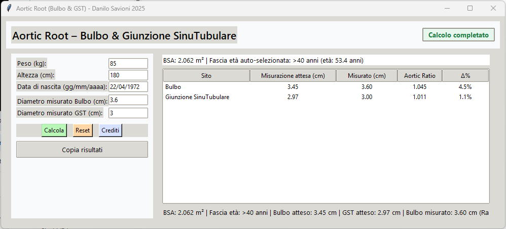

[README.md](https://github.com/user-attachments/files/22521914/README.md)


# Aortic Root App – Bulbus & Sinotubular Junction  

A Python GUI application (Tkinter) designed to calculate and evaluate the diameters of the aortic root (**Bulbus** and **Sinotubular Junction**) based on **Body Surface Area (BSA)** and the patient’s age group.  

This tool was created for educational and clinical support purposes, offering a compact, user-friendly interface for quick calculations and result visualization.  

---

## ✨ Features  

- **Input fields** for:  
  - Weight (kg)  
  - Height (cm)  
  - Date of birth (auto age detection)  
  - Measured diameters (Bulbus & STJ, in cm)  

- **Automatic BSA calculation** using the Mosteller formula:  
  ```
  BSA = sqrt((weight * height) / 3600)
  ```  

- **Age-group auto-selection** with dedicated formulas:  

  **Bulbus**  
  - <18 years: `1.02 + (0.98 * BSA)`  
  - 18–40 years: `0.97 + (1.12 * BSA)`  
  - >40 years: `1.92 + (0.74 * BSA)`  

  **Sinotubular Junction (STJ)**  
  - <18 years: `0.87 + (0.80 * BSA)`  
  - 18–40 years: `1.06 + (0.82 * BSA)`  
  - >40 years: `1.69 + (0.62 * BSA)`  

- **Result table** showing:  
  - Expected diameter  
  - Measured diameter  
  - **Aortic Ratio** (measured/expected)  
  - **Δ% deviation from 1**  

- **Clipboard export**: copy results in plain text for easy reporting.  
- **Compact, resizable GUI** with light and clear design.  
- **Color-coded buttons** for quick interaction:  
  - ✅ Calculate (light green)  
  - 🔄 Reset (light orange)  
  - ℹ️ Credits (light blue)  

---

## 🖼 User Interface  

- Modern Tkinter layout.  
- Compact table view for results.  
- Status pill indicators to highlight normal, above-expected, or below-expected results.  
- Auto-selected age group clearly displayed in the header.  

---

## 🚀 Run the Application  

Requirements:  
- **Python 3.x**  
- **tkinter** (usually included with Python)  

Run with:  
```bash
python aortic_ratio_gui_v2_1_4.py
```

---


## 📜 Credits  

```
Programmed with passion by Danilo Savioni and Stella AI
On a rainy afternoon in September 2025.
```
